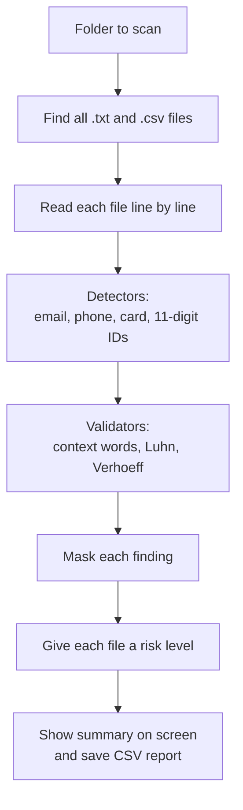

# Design: pii-guard-ng

This document describes how pii-guard-ng is structured, how it detects
sensitive data, and how it reports results safely.

Status key: ✅ built, 🔜 planned.

---

## 1. How the Tool Works

## 2. Components

| Component | What it does | Status |
|---|---|---|
| Email detector | Finds email addresses using a pattern | ✅ |
| Nigerian phone detector | Finds local (080...) and international (+234...) mobile numbers | ✅ |
| NIN / BVN detector | Finds 11-digit numbers and labels them using words on the same line | ✅ |
| Card detector | Finds 13 to 19 digit card numbers | ✅ |
| Luhn validator | Checks card numbers are mathematically valid, to cut false alarms | ✅ |
| Verhoeff validator | Checks the NIN checksum digit | ✅ |
| Folder scanner | Scans every .txt and .csv file in a chosen folder | ✅ |
| CSV reader | Pairs each cell with its column name so labels can be detected | ✅ |
| Masking | Hides most of each sensitive value in all output | ✅ |
| Risk scoring | Rates each file as High, Medium, Low or Clean | ✅ |
| Report writer | Saves masked results to a CSV file with line numbers | ✅ |
| Automated tests | Checks every detector and validator automatically | 🔜 Week 3 |

## 3. Detection Rules

- **Email:** standard email pattern (name@domain.tld).
- **Nigerian phone:** starts with 0, 234 or +234, followed by a network
  prefix (70x, 80x, 81x, 90x, 91x) and 7 more digits. Spaces or dashes allowed.
- **NIN / BVN:** exactly 11 digits. Labelled NIN or BVN only if a matching
  keyword appears earlier on the same line (or in the same CSV cell's column
  name). Keywords are matched as whole words, so "evening" is not mistaken
  for "NIN".
- **Possible ID:** an unlabelled 11-digit number that is not a phone number.
  Flagged for review, because missing real sensitive data is worse than a
  false alarm.
- **Card number:** 13 to 19 digits (spaces or dashes allowed), reported only
  if it passes the Luhn check and is not a Nigerian phone number.

### How CSV files are handled

In a CSV file the label (column name) is on the first line while the values
are on later lines, so each row is rewritten as `column: value` pairs
separated by `|` before scanning. For example:

`full name: Ada Eze | nin: 12345678904 | bvn: 22000000001`

This lets the same detectors work on CSV files, and the `|` separator stops
a value from picking up the label of a neighbouring cell.

## 4. Validation (Reducing False Positives)

| Check | Applies to | Result if it fails |
|---|---|---|
| Context keywords | NIN and BVN | Treated as phone number or Possible ID |
| Luhn checksum | Card numbers | Not reported (likely a random number) |
| Verhoeff checksum | NIN | Reported as "NIN (checksum failed)" so it can still be reviewed |

## 5. Masking (Privacy by Design)

The tool must never become a new source of leaks, so every value is
masked before it is shown on screen or saved to the report.

| Data type | Original | Masked |
|---|---|---|
| Email | tunde.bakare@example.com | t***@example.com |
| Phone | 0803 000 0001 | *******0001 |
| NIN / BVN / Possible ID | 12345678904 | *******8904 |
| Card | 4111 1111 1111 1111 | ************1111 |

## 6. Risk Levels

Each file gets one risk level based on the most sensitive item found:

| Level | Rule |
|---|---|
| High | Any NIN, BVN or valid card number |
| Medium | Phone numbers or Possible IDs (but nothing High) |
| Low | Email addresses only |
| Clean | Nothing found |

## 7. Report Output

Results are saved to `reports/report.csv` with these columns:

`file, line, data_type, masked_value, file_risk`

Only masked values are written. The `reports` folder is excluded from Git,
so scan results are never uploaded to GitHub by accident.

## 8. Security and Ethics Decisions

- **Fully offline:** no internet connection or cloud service is used, so
  scanned data never leaves the computer.
- **Standard library only:** no third-party packages, which keeps the tool
  simple and reduces supply-chain risk.
- **Masked output:** sensitive values are never displayed or saved in full.
- **Hidden folders skipped:** folders such as `.venv` and `.git` are not
  scanned.
- **Fake test data only:** all sample files use made-up values, reserved
  example.com, example.org and example.net email domains, and public payment
  test card numbers.

## 9. Known Limitations

- Only .txt and .csv files are supported (not Word, Excel or PDF).
- NIN and BVN labels must appear on the same line as the number.
- Context keywords are English only.
- BVN has no public checksum, so it relies on context words alone.
- CSV cells that span several lines can shift the reported line numbers.
- The report is overwritten each time the tool runs.
- Pattern-based detection can still miss unusual formats or flag
  look-alike numbers.